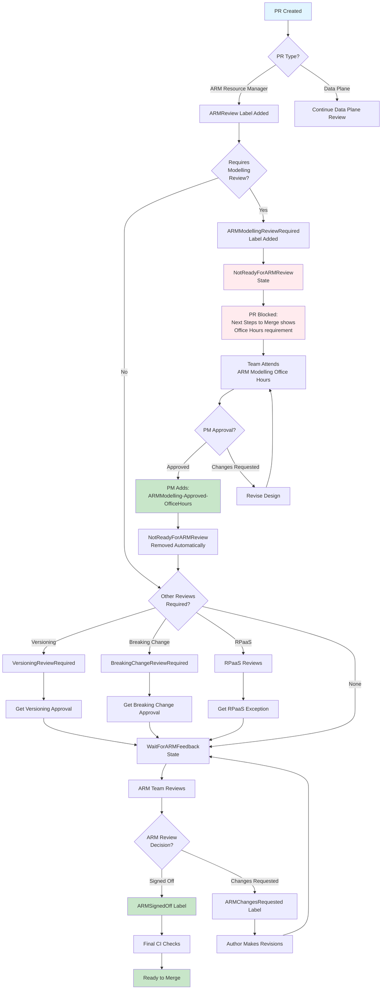

# ARM Modelling Review Workflow Diagram

This diagram illustrates how the ARMModellingReviewRequired label integrates into the PR review workflow.

## Key States

### Before Modelling Review
- **ARMReview**: PR is in scope for ARM review
- **ARMModellingReviewRequired**: Modelling review is needed
- **NotReadyForARMReview**: PR is blocked until modelling review completes

### After Modelling Review
- **ARMModelling-Approved-OfficeHours**: Modelling review completed successfully
- **WaitForARMFeedback**: Awaiting ARM team review
- **ARMSignedOff**: Final approval to merge

## Parallel Review Requirements

The ARMModellingReviewRequired check runs in parallel with other review requirements:
- VersioningReviewRequired + Versioning-Approved-* labels
- BreakingChangeReviewRequired + BreakingChange-Approved-* labels
- CI-NewRPNamespaceWithoutRPaaS + RPaaSException

All blocking requirements must be resolved before the PR can proceed to WaitForARMFeedback state.

## Label Transitions

The automation handles the following transitions:

1. When `ARMModellingReviewRequired` is present:
   - `NotReadyForARMReview` is automatically added
   - PR cannot proceed until approval

2. When `ARMModelling-Approved-OfficeHours` is added:
   - Modelling review requirement is satisfied
   - If no other blocking issues, `NotReadyForARMReview` is removed
   - PR transitions to `WaitForARMFeedback`

3. If approval is removed or new modelling concerns arise:
   - `NotReadyForARMReview` is re-added
   - Process repeats from office hours step
